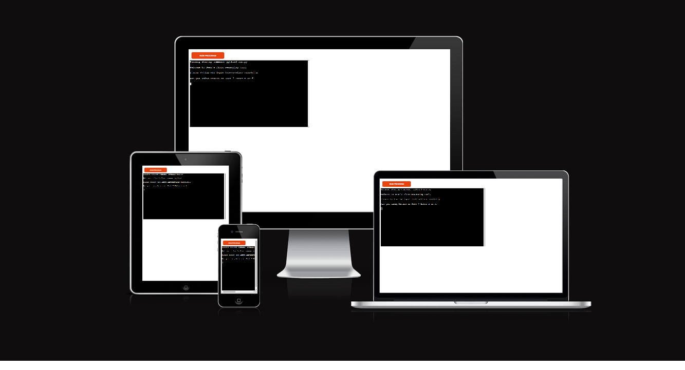
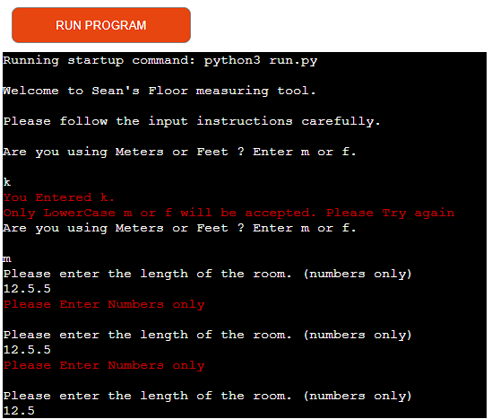
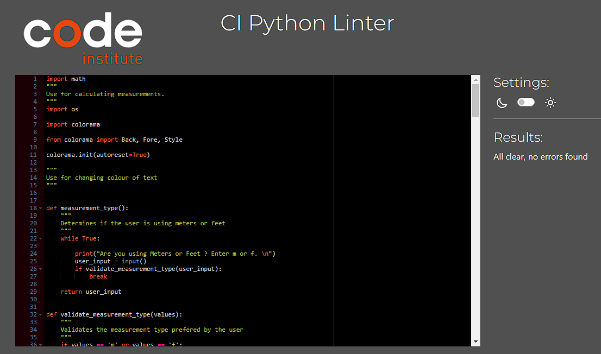

# Flooring Measuring Tool

  

  

This is a measuring tool designed to help clients easily determine how many boxes of flooring they will need for a job and how much it will cost.

  

  

I built it to demonstrate my abilities in Python and as a tool I can use in the real world.

  

  

The tool takes several inputs from the user and calculates the size of the area being worked and how many boxes will be needed to cover said area. It also calculates any discount that may be currently available. In this instance it will be either 3 for 2, 4 for 3 or a percentage off offer.

  

  

https://flooringcalculator-4a8f9f1ad4d5.herokuapp.com/

  

  

  

  

---

  

  

## How To Use

  

  

The user is invited to input several pieces of information one at a time.

  

  

The first input asked is the measurment type being used. Feet or Meters.

  

  

Once the measurement is determined the user is then asked for the length and width of the space to be covered.

  

  

The next input determines the coverage in each box. This allows for the varied options of flooring as different styles will have a different square meter coverage per box.

  

  

Next is the cost/price of each box.

  

  

This information is then calculated and the number of boxes required and the full cost is returned to the user.

  

  

At the point the user can start again or select if their is an offer currently active. The offers usually running are 3 for 2, 4 for 3 or a percentage off.

  

  

If the user selects '3 for 2' or '4 for 3' the program will calculate the discount and return the new total. If the user selects the percentage off they are then asked to enter the percentage amount. This is then used to calculate the dicscount with the percentage off and returns it to the user.

  

  
  

## Features

  

  

### Conversion.

  

  

The metric system may be the offical measurment used in most of europe however a lot of people still use imperial so this is taken into account.

  

  

The first thing the program does is determine which measurement type the user prefers. If feet are chosen this value is then converted to meters within the program.

  

  

### Calculation of offer.

  

  

The most common offer on flooring is a '3 for the price of 2', '4 for the price of 3' or a percentage off. This is taken into account in the program and the user is given the option to choose one if the offer is active.

  

  

The program then calculates the offer by dividing by 3 and multiplying by 2 or dividing by 4 and multiplying by 3. 

To get an actual price per box and avoid fractions, the calculation removes any remainder in the initial division and then adds the remainder back in to the equation before returning the new cost. 

In the case of the percentage off offer it divides the total by 100 and multiplies by the percentage off (as inputted by the user). 
This is then subtracted from the total cost to give the final cost with the offer applied. 
  

### Input validation and error checking.

When the user is asked for m or f to choose measurement type the program will only accept one of these inputs. Anything else will return an error advising what was entered and explaining that they must only use lowercase m or f.

When asking the user for numerical inputs for length, width , price etc. The program will only accept numerical values either as whole numbers or numbers with decimel points. Anything else will display an error and ask to try again.

### User Stories

This app is designed for use predominantly by sales people.

In big box Home and DIY stores there are usually specialists in each area of the store. For example in Woodies DIY there is a paint specialist, a DIY specialist, a Horticulturist, a building/flooring specialist etc. These people are highly trained/experienced in their specific area and handle most queries and sales. However when they are not available the other colleagues have to step in and help out and this is ok for the most part but one of the areas people find most difficult is calculating flooring.

  

How many boxes the customer will need and how much it will cost based on the current offer? Are they using feet or meters? Will I need to convert the measurements? and so on. This leads to staff avoiding these interactions and waiting for the return of the 'Specialist'. This means lost sales and unhappy customers.

  

With this tool it is now simple to calculate exactly what the customer needs without any need for conversions or calculators.

  

This takes away the uncertainty and fear of making a costly mistake from the sales person and instead allows them to concentrate on talking to the customer and up-selling.

It's also just as useful for customers as they can now 'self serve' and get the correct pricing without any concerns for conversions and calculations.

I have been using it in my work (I work in Woodies DIY) for the past couple of weeks and it's already having an impact. Several of my colleagues are now using it on their phones and we have it bookmarked on the store PC. 

One of my team leaders told me they activley avoided the flooring section before due to the difficulty they had in working out the calculations. 

With this program they have no such issues. 

  
  
  

## Testing

  

  

I have tested this project by doing the following.

  

  

Passed all the code through pep8 python linter.

Tested in the local terminal and the code institute heroku terminal.

  

### Input testing.

  

## validate_measurement_type(values):

  
This Function is designed to determine if the user is using feet or meters and only allows lower case m or f to be passed. It alerts the user if the wrong input is entered and runs the function again. 

| **Inputs** | **Expected Outcome** | **Actual Outcome** |
| :-------- | :------- | :------------------------- |
| Blank Space | Only LowerCase m or f will be accepted. Please Try again.| Only LowerCase m or f will be accepted. Please Try again. |
| Numbers with and without Decimal | Only LowerCase m or f will be accepted. Please Try again.| Only LowerCase m or f will be accepted. Please Try again. |
| Strings | Only LowerCase m or f will be accepted. Please Try again.| Only LowerCase m or f will be accepted. Please Try again. |
| Symbols | Only LowerCase m or f will be accepted. Please Try again.| Only LowerCase m or f will be accepted. Please Try again. |
| Capital M/F | Only LowerCase m or f will be accepted. Please Try again.| Only LowerCase m or f will be accepted. Please Try again. |
| Random Mix of above | Only LowerCase m or f will be accepted. Please Try again.| Only LowerCase m or f will be accepted. Please Try again. |

## validate_num(values):

This function is used several times in the program. It determines if the input is a number either with or without a decimal and wont allow anything else to pass. 
It also wont accept 0 (zero) or less to avoid any zero division errors. 
If the user inputs the wrong values they are advised of what they have entered and the function is run again. 

| **Inputs** | **Expected Outcome** | **Actual Outcome** |
| :-------- | :------- | :------------------------- |
| Blank Space | Please Enter Numbers only.| Please Enter Numbers only. |
| Numbers with multiple Decimals | Please Enter Numbers only.| Please Enter Numbers only. |
| Strings | Please Enter Numbers only.| Please Enter Numbers only. |
| Symbols | Please Enter Numbers only.| Please Enter Numbers only. |
| 0 (zero) | Please Enter Numbers only.| Please Enter Numbers only. |
| Negative Numbers | Please Enter Numbers only.| Please Enter Numbers only. |

## validate_offer_type(values):

This function determines the type of offer that is currently active and only allows the pre determined inputs to pass. 1,2,3 or 4. 
Any other input will advise the user of the error and run the function again.  

| **Inputs** | **Expected Outcome** | **Actual Outcome** |
| :-------- | :------- | :------------------------- |
| Blank Space | You Entered (input). Only 1, 2, 3 or 4 will be accepted. Please Try again..| You Entered (input). Only 1, 2, 3 or 4 will be accepted. Please Try again.. |
| Numbers other than 1,2,3,4 | You Entered (input). Only 1, 2, 3 or 4 will be accepted. Please Try again..| You Entered (input). Only 1, 2, 3 or 4 will be accepted. Please Try again.. |
| Strings | You Entered (input). Only 1, 2, 3 or 4 will be accepted. Please Try again..| You Entered (input). Only 1, 2, 3 or 4 will be accepted. Please Try again.. |
| Symbols | You Entered (input). Only 1, 2, 3 or 4 will be accepted. Please Try again..| You Entered (input). Only 1, 2, 3 or 4 will be accepted. Please Try again.. |
| 0 (zero) | You Entered (input). Only 1, 2, 3 or 4 will be accepted. Please Try again..| You Entered (input). Only 1, 2, 3 or 4 will be accepted. Please Try again..|
| Negative Numbers | You Entered (input). Only 1, 2, 3 or 4 will be accepted. Please Try again..| You Entered (input). Only 1, 2, 3 or 4 will be accepted. Please Try again.. |

## validate_start_over(values):
  

| **Inputs** | **Expected Outcome** | **Actual Outcome** |
| :-------- | :------- | :------------------------- |
| Blank Space | You Entered (input). Only LowerCase y or n will be accepted. Please Try again. |You Entered (input). Only LowerCase y or n will be accepted. Please Try again. |
| Numbers with and without Decimal | You Entered (input). Only LowerCase y or n will be accepted. Please Try again. |You Entered (input). Only LowerCase y or n will be accepted. Please Try again.|
| Strings | You Entered (input). Only LowerCase y or n will be accepted. Please Try again.| You Entered (input). Only LowerCase y or n will be accepted. Please Try again. |
| Symbols | You Entered (input). Only LowerCase y or n will be accepted. Please Try again.| You Entered (input). Only LowerCase y or n will be accepted. Please Try again. |
| Capital Y/N | You Entered (input). Only LowerCase y or n will be accepted. Please Try again.| You Entered (input). Only LowerCase y or n will be accepted. Please Try again. |
| Random Mix of above | You Entered (input). Only LowerCase y or n will be accepted. Please Try again.| You Entered (input). Only LowerCase y or n will be accepted. Please Try again.|

  
  

## Bugs

  

I had some issues with validate_num(values):

  

I had written the function using replace and isnumeric methods. This worked until I input a number with more than one decimel point. 1.2.3 for example passed and was accepted as a number which then threw an error as it couldn't be converted from string to a float.

  

I re-wrote the code to use float(values) and now it passes only genuine floats or int

However this didn't account for 0 (zero) as an input which then threw a zero division error so I had to add in a requirement that the input be of a value greater than 0 (zero).   

There were minor bugs in the code when ran through the python linter. Some empty space and lines too long.

  

### Remaining Bugs.

There are no remaining bugs.

  

### Validator Testing

PEP8

No errors were returned from https://pep8ci.herokuapp.com/

## Deployment

  

This project was deployed using Code Institute's mock terminal for Heroku.

  

### Steps for Deployment

  

#### Deployment

The site is deployed using GitHub Pages - https://github.com/seanorourke7/FlooringCalc

  

To Deploy the site using GitHub Pages:

  

Login (or signup) to Github.

Go to the repository for this project, seanorourke7/FlooringCalc.

Click the settings button.

Select pages in the left hand navigation menu.

From the source dropdown select main branch and press save.

The site has now been deployed, please note that this process may take a few minutes before the site goes live.

#### How to Fork

To fork the repository:

  

Log in (or sign up) to Github.

Go to the repository for this project, seanorourke7/FlooringCalc.

Click the Fork button in the top right corner.

How to Clone

To clone the repository:

  

Log in (or sign up) to GitHub.

Go to the repository for this project, seanorourke7/FlooringCalc.

Click on the code button, select whether you would like to clone with HTTPS, SSH or GitHub CLI and copy the link shown.

Open the terminal in your code editor and change the current working directory to the location you want to use for the cloned directory.

Type 'git clone' into the terminal and then paste the link you copied in step 3. Press enter.

  
  

## Credits

Code institute for the deployment terminal